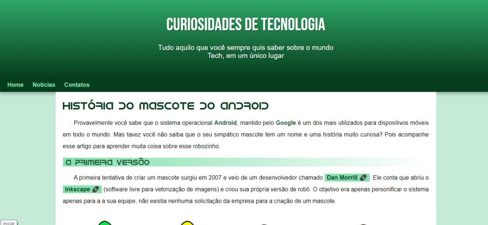

# AivanDroid

O projeto AivanDroid, foi desenvolvido através de um curso gratuito da plataforma YouTube, fornecido e administrado pelo professor Guanabara, criador do curso em video

AivanDroid é um projeto com um objetivo simples, levando em conta que ele é um site informativo, com um foco mais jornalístico. Ele tem o objetivo de levar notícias até as pessoas, um exemplo é o próprio tema Android

## Demonstração

## 💻 Tech Stack:
  
  

## Material

https://www.youtube.com/watch?v=cKEA0-MOhOs

## Licença

[MIT License](https://choosealicense.com/licenses/mit/)

## Suporte

Para suporte, mande um email para ivan.rocha.0987@gmail.com ou entre em contato via whatsapp (41) 98468-5317.

## Feedback

Se você tiver algum feedback, por favor enviar para ivan.rocha.0987@gmail.com

## Autores

- [@IvanRocha](https://www.github.com/ivanrocha10)
- [@CursoEmVideo](https://github.com/gustavoguanabara)

## Projeto

  Acesse o "AivanDroid" pelo QR:

  

Caso o QR não funcione, acesse <a href="https://ivanrocha10.github.io/AivanDroid/">aqui</a>